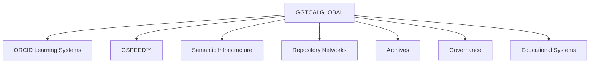

# GGTCAI.GLOBAL-ORCIDResearchInfrastructure-VAI000
ORCID RESEARCH INFRASTRUCTURE + SEMANTIC CONTINUITY ECOSYSTEM 

# GGTCAI.GLOBAL-ORCIDResearchInfrastructure-VAI000

<div align="center">

# 🌐 GGTCAI.GLOBAL

## ORCID RESEARCH INFRASTRUCTURE + SEMANTIC CONTINUITY ECOSYSTEM

Educational Repository · Research Identity Systems · Metadata Synchronization · GSPEED™ Network Architecture


</div>

---

# 🕰️ GGTCAI.GLOBAL MASTER SYSTEMS UPDATE

## Date
May 20, 2026

## Time
17:02 GGTCAI.GLOBAL

## Classification
Research Infrastructure + ORCID Integration + Semantic Continuity Systems

## Status
ACTIVE

---

# 📦 LOG BOOK ENTRY

GGTCAI.GLOBAL ecosystem operations continue with active development of educational and research infrastructure systems connected to ORCID organizational membership and metadata continuity frameworks.

Current operational activities include:

- ORCID ecosystem integration research
- GitHub repository development
- semantic infrastructure documentation
- metadata synchronization systems
- educational continuity expansion
- repository interoperability planning
- GSPEED™ operational architecture management
- governance continuity systems
- archive preservation operations
- synchronized infrastructure coordination

---

# 📚 INDEX

1. Repository Overview
2. About ORCID
3. ORCID + GGTCAI.GLOBAL
4. Educational Objectives
5. Research Infrastructure
6. Semantic Continuity Systems
7. GSPEED™ Architecture
8. Repository Structure
9. Glossary
10. Documentation Hub
11. Public Access Notice
12. License
13. Official References
14. Version Information

---

# 🌍 REPOSITORY OVERVIEW

This repository serves as an educational and infrastructure-oriented resource focused on:

- ORCID ecosystem learning
- persistent research identity systems
- metadata synchronization
- semantic continuity infrastructure
- repository interoperability
- educational documentation
- governance-aligned systems
- GSPEED™ synchronized architecture
- archive continuity
- distributed operational coordination

The repository is designed to help users better understand modern research infrastructure systems and their relationship to semantic continuity ecosystems.

---

# 🧠 ABOUT ORCID

## What Is ORCID?

ORCID stands for:

```text
Open Researcher and Contributor ID
```

ORCID provides persistent digital identifiers for researchers and contributors across institutional and scholarly ecosystems.

Official ORCID website:

```text
https://info.orcid.org/
```

Example ORCID Identifier:

```text
https://orcid.org/0000-0002-1825-0097
```

---

# 🎓 WHY ORCID MATTERS

ORCID helps solve major research infrastructure challenges including:

- researcher identity confusion
- fragmented publication records
- disconnected metadata systems
- inconsistent attribution systems
- institutional interoperability limitations

ORCID supports:

| Function | Purpose |
|---|---|
| Persistent Identity | Long-term contributor continuity |
| Metadata Synchronization | Cross-platform interoperability |
| Research Attribution | Verified contributor tracking |
| Institutional Integration | Connected infrastructure systems |
| Repository Interoperability | Shared metadata continuity |
| Scholarly Continuity | Long-term archival identity |

---

# 🌐 ORCID + GGTCAI.GLOBAL

GGTCAI.GLOBAL explores concepts related to:

- semantic continuity
- metadata synchronization
- distributed repository ecosystems
- governance-aligned infrastructure
- archive preservation systems
- educational infrastructure expansion
- synchronized operational continuity

These concepts overlap with principles used in modern research infrastructure systems such as ORCID.

---

# ⚡ GSPEED™ NETWORK ARCHITECTURE

## Overview

GSPEED™ Network Architecture represents the synchronized infrastructure framework supporting:

- semantic continuity
- metadata propagation
- ecosystem coordination
- archive synchronization
- repository interoperability
- governance continuity
- AI-aligned infrastructure systems
- educational infrastructure scalability

---

# 🎯 EDUCATIONAL OBJECTIVES

This repository supports learning and exploration related to:

- ORCID systems
- persistent identifiers
- semantic infrastructure
- repository synchronization
- metadata continuity
- governance systems
- scholarly interoperability
- archive preservation
- ecosystem-scale operational frameworks

---

# 🛰️ RESEARCH INFRASTRUCTURE OVERVIEW

Modern research ecosystems increasingly depend on:

| Infrastructure Area | Function |
|---|---|
| Persistent Identifiers | Contributor continuity |
| Metadata Systems | Interoperability |
| Repository Networks | Knowledge preservation |
| Semantic Infrastructure | Structured continuity |
| Governance Systems | Operational alignment |
| Archive Systems | Long-term preservation |
| Synchronization Layers | Ecosystem coordination |

---

# 🌍 WHAT MAKES THIS REPOSITORY DIFFERENT

Unlike repositories focused only on software deployment, this repository emphasizes:

- educational infrastructure
- semantic continuity systems
- metadata synchronization
- ORCID ecosystem learning
- governance-oriented frameworks
- distributed archive continuity
- GSPEED™ synchronization systems
- ecosystem-scale operational concepts

This creates a hybrid educational and infrastructure-oriented repository experience.

---

# 🏗️ REPOSITORY STRUCTURE

```text
/Documentation
/ORCID
/Governance
/SemanticSystems
/GSPEED
/ResearchInfrastructure
/SystemLogs
/Archives
/MetaPackets
/EducationalSystems
/RepositoryNetworks
/ContinuityFrameworks
```

---

# 🔄 ECOSYSTEM ARCHITECTURE



---

# 📖 GLOSSARY

## Archive Continuity
Long-term preservation systems supporting metadata and repository continuity.

## Ecosystem Synchronization
Distributed operational alignment across repositories and infrastructure systems.

## GSPEED™ Network Architecture
Operational synchronization framework supporting semantic continuity and metadata coordination.

## Metadata Synchronization
Alignment and interoperability of structured information across platforms and repositories.

## ORCID
Open Researcher and Contributor ID — a persistent digital identifier system for researchers and contributors.

## Persistent Identifier
A stable digital identifier designed to maintain long-term continuity and attribution.

## Repository Interoperability
The ability of repositories and systems to exchange metadata and operate together effectively.

## Semantic Continuity
Preservation of meaning structures, metadata systems, and synchronized operational frameworks across time.

## Semantic Infrastructure
Operational systems supporting metadata indexing, synchronization, interoperability, and continuity preservation.

---

# 📚 DOCUMENTATION HUB

| Document | Purpose |
|---|---|
| README.md | Main educational overview |
| ORCID.md | ORCID learning resources |
| GLOSSARY.md | Terminology reference |
| GOVERNANCE.md | Governance systems |
| GSPEED.md | GSPEED™ architecture |
| CHANGELOG.md | Repository history |
| INDEX.md | Navigation systems |

---

# 📈 CHANGELOG

## May 20 2026 · 17:02

- ORCID educational repository initialized
- semantic continuity documentation expanded
- GSPEED™ infrastructure framework synchronized
- metadata systems documentation updated
- repository interoperability structures expanded
- educational systems continuity verified

---

# 🌐 PUBLIC ACCESS NOTICE

This repository is publicly accessible for:

- educational learning
- research infrastructure study
- metadata systems exploration
- semantic continuity analysis
- repository interoperability research
- governance systems learning
- archive preservation review

Public visibility does NOT transfer:

- governance authority
- commercialization rights
- infrastructure ownership
- ORCID organizational authority
- GSPEED™ operational authority

---

# 📜 LICENSE

See:

LICENSE.md

---

# ⚖️ IMPORTANT NOTICE

GGTCAI.GLOBAL operates independently and is not affiliated with, endorsed by, or officially operated by ORCID.

ORCID references within this repository are educational and informational in nature.

ORCID® is a registered trademark of ORCID, Inc.

---

# 🔗 OFFICIAL REFERENCES

```text
GGTCAI.GLOBAL
GGTC.info
operations@GGTC.info
Quibhoball.com
https://info.orcid.org/
```

---

# 🧩 VERSION INFORMATION

| Category | Value |
|---|---|
| Repository Version | V10AI |
| Infrastructure Series | VAI000 |
| Repository Status | ACTIVE |
| Repository Classification | PUBLIC |
| GSPEED™ Status | OPERATIONAL |
| Educational Infrastructure | ACTIVE |

---

# 🌍 FINAL CONTINUITY STATEMENT

```text
The GGTCAI.GLOBAL ecosystem continues operating as a distributed
semantic continuity infrastructure supporting educational systems,
metadata synchronization, ORCID ecosystem learning, repository
interoperability, governance continuity, and scalable AI-aligned
infrastructure operations.
```